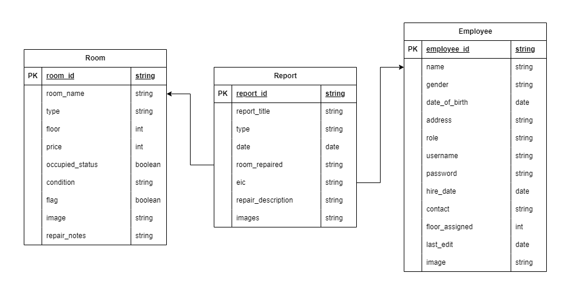
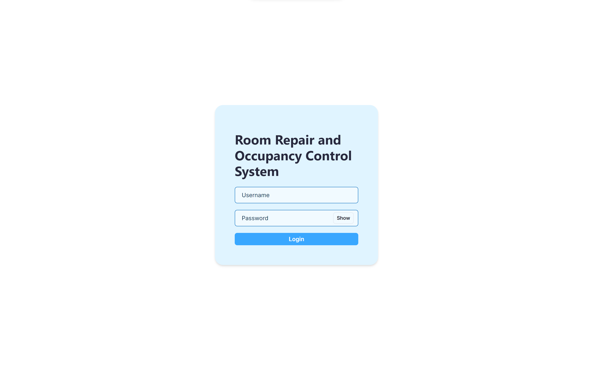
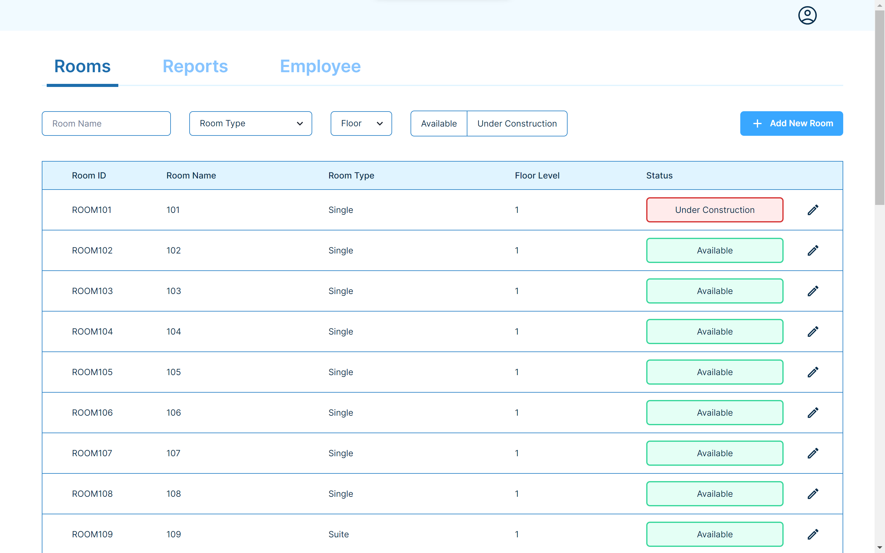
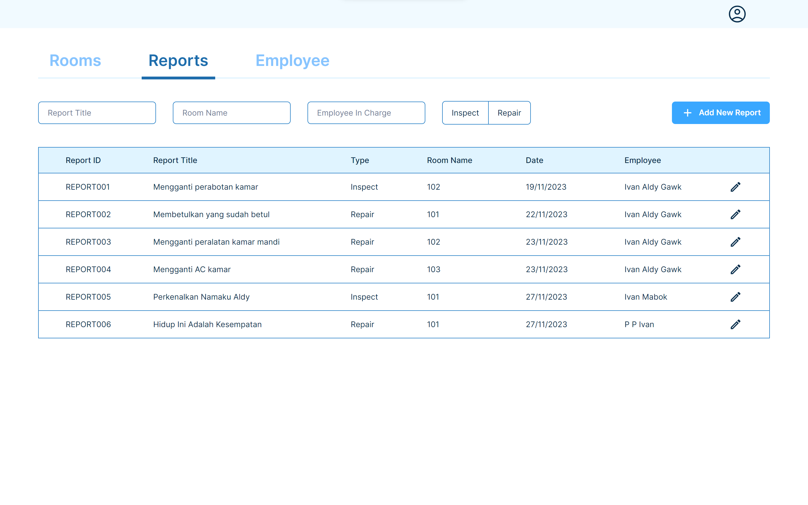
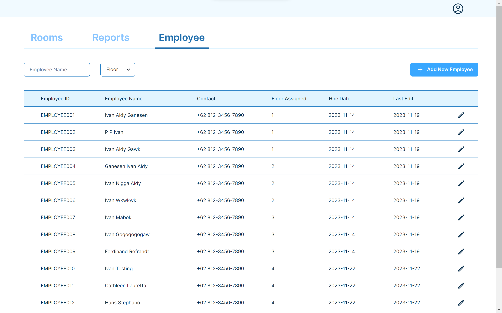
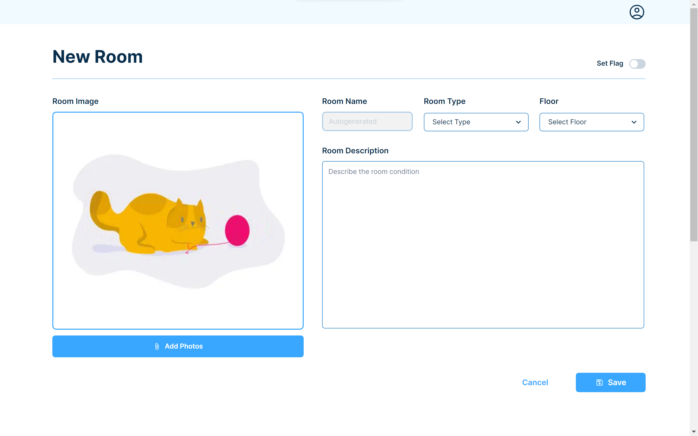
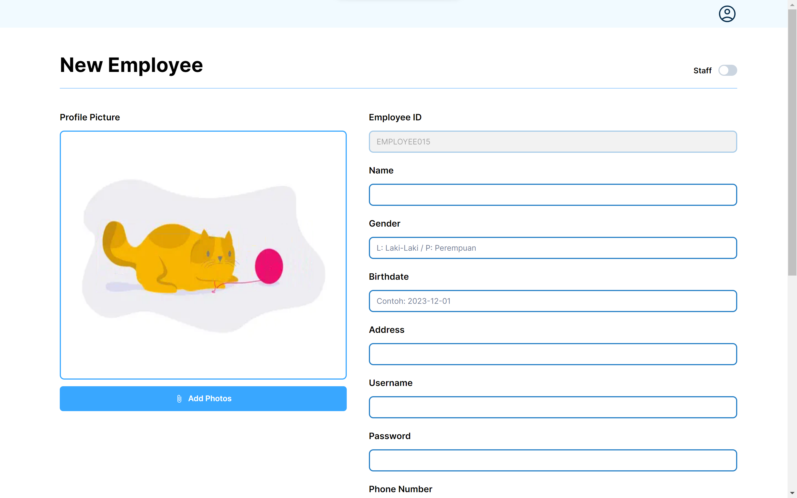
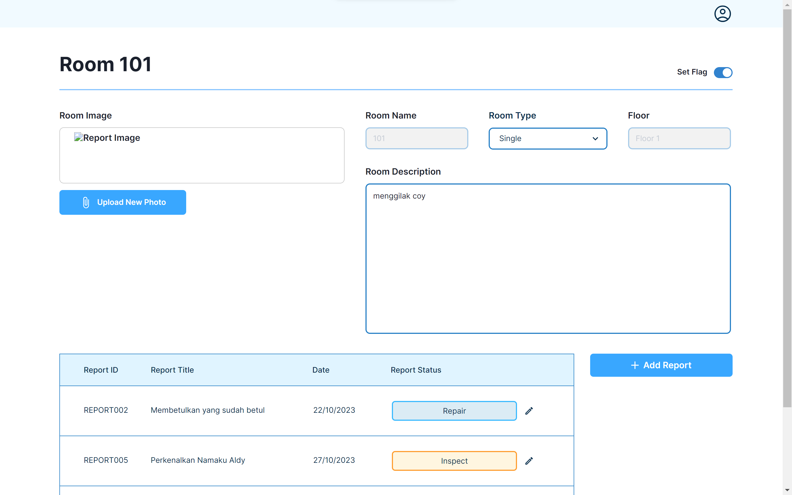
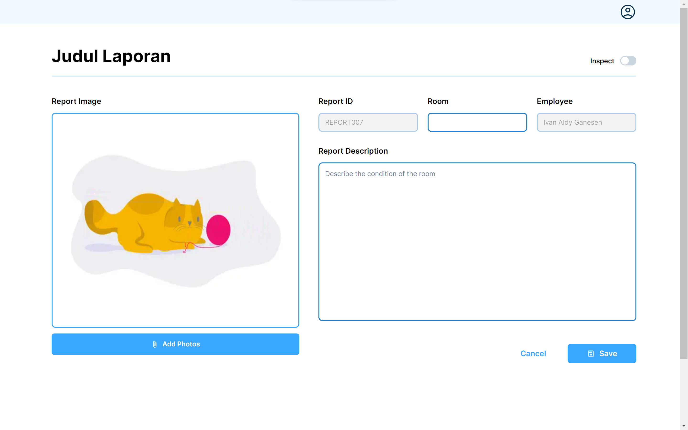
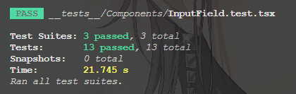

# Room Repair and Occupancy Control System
## IF3152 Rekayasa Perangkat Lunak STI

## Table of Contents
- [Program Description](#program-description)
- [Requirements](#requirements)
- [How to Run the Program](#how-to-run-the-program)
- [Database Schema](#database-schema)
- [Use Case Implementation](#use-case-implementation)
- [Captured Screens](#captured-screens)
- [Project Structure](#project-structure)
- [Testing Results](#testing-results)
- [Authors](#authors)

## Program Description
<div style="text-align: justify">&ensp;&thinsp;&ensp;&thinsp;Once upon a time, Mr. Gagas, as a hotel owner, feels deeply overwhelmed by the amount of complaints he received from his customers. Most were arguing about the damages that each room has suffered, up to the fact that not just one, but <b>more than one</b> discovered that the room they're getting assigned to is actually on a very bad state and/or not used for such a long time.<br>
&ensp;&thinsp;&ensp;&thinsp;Looking at this, Mr. Gagas has assembled our team of members Aldy, Cathleen, Ferdinand and Hans to come up with a solution to fix this. He feels that the longer this problem gets fixed, the more loss he's going to acquire instead of profit.<br>
&ensp;&thinsp;&ensp;&thinsp;After careful considerations and plannings, we finally came with the concept of <b><i>Room Repair and Occupancy Control System</b></i>, or abbreviated as <b><i>RORO Control System</b></i>. RORO Control System is a web-based software used to manage room and hotel facilities repairment. Three important aspects that are being covered in this software are:</div>
<li> Room → Contains all the informations about rooms, including the type, price, and the availability.
<li> Report → Contains all the informations essential to report created when handling a room that needs repair.
<li> Employee → Containts all the informations needed regarding a staff (including admin), such as hired date, address, and full name.
<div style="text-align: justify">&ensp;&thinsp;&ensp;&thinsp;<i>Hopes are high that this system will be able to fix Mr. Gagas' problems and hopefully bring more profit for his hotel ~</i><br></div>

## Requirements
- [NodeJS](https://nodejs.org/en/download)

## How to Run the Program
1. Clone this repository
   ```sh
   git clone https://gitlab.informatika.org/agent-47/if3152-2023-k01-07-roro-control-system.git
   ```

2. Change the directory to the cloned repository
   ```sh
   cd if3152-2023-k01-07-roro-control-system
   ```

3. Install the required package
   ```
   npm install
   ```

4. Run the program
   ```
   npm run dev
   ```

5. Open the program in a new browser tab or you can access the program on ``localhost:3000``

## Database Schema

<div style="text-align: justify">&ensp;&thinsp;&ensp;&thinsp; For our database schema, we used three tables, namely, Room, Report, and Employee. As you can probably see, they all have different informations to store, and what probably connects them is the fact that Room and Report are linked by <code> room_repaired, room_name </code> attribute, while Report and Employee are linked by  <code> eic, name </code>.</div>

## Use Case Implementation
| Use Case | Description |
|---|---|
| Use Case 1 | Log In |
| Use Case 2 | View Room List |
| Use Case 3 | Add New Room |
| Use Case 4 | Change Room Data |
| Use Case 5 | View Report List |
| Use Case 6 | Add New Report |
| Use Case 7 | Mark a Room for Repair |
| Use Case 8 | Remove Repair Mark |
| Use Case 9 | View Employee List |
| Use Case 10 | Add New Employee |
| Use Case 11 | Change Employee Data |

| | 18221045 | 18221157 | 18221169 | 18221171 | |
|---|---|---|---|---|---|
|| Ivan Aldy Ganesen | Cathleen Lauretta | Ferdinand Refrandt | Hans Stephano Edbert N |
| UC 1 | &check; | | | |
| UC 2 | &check; | &check; | | |
| UC 3 | | | &check; | &check; |
| UC 4 | | | &check; | |
| UC 5 | &check; | &check; | | |
| UC 6 | | | | &check; |
| UC 7 | | | &check; | |
| UC 8 | | | &check; | |
| UC 9 | &check; | &check; | | |
| UC 10 | | | | &check; |
| UC 11 | | | &check;| |

## Captured Screens
Below are the interface of RORO Control System
1. <b>Login Page</b>


2. <b>Admin - Room List</b> : There are "Add Room" button if the user is admin


3. <b>Admin - Report List</b>


4. <b>Admin - Employee List</b> : Employee List can only be accessed by Admin


5. <b>Admin - Add Room</b> : Only Admin can add new room to the database


6. <b>Admin - Add Employee</b> : Only Admin can add new employee to the database


7. <b>Admin - Edit Room</b> : Only Admin can edit existed room


8. <b>Add Report</b> : Report cannot be edit by employee or admin


## Project Structure
    .
    ├─ __test__                     # Contains unit and/or component testing(s)
    ├─ doc                          # Contains database schema, testing results, and screenshots of application
        └─ screenshots
    ├─ prisma                       # Contains prisma library to CRUD database
    ├─ public                       # Contains icon used in the application
        └─ icons
    └─ src                          # Contains source code of the application
        ├─ app                      # Consists of the routings used in the app and pages
            ├─ api
            ├─ employee     
            ├─ login
            ├─ profile
            ├─ report
            └─ room
        ├─ components               # Consists of reusable components in the program
        ├─ pages                    # Consists of API interface(s)
            └─ api
        └─ types                    # Consists of interfaces needed to fulfill one aspect of the authentication provided by Next.js

## Testing Results

<div style="text-align: justify">&ensp;&thinsp;&ensp;&thinsp; We did some testing for the InputField component and the Room's FrontEnd page, and everything is a success. <i>However, there's a slight issue when testing for Report and Employee is conducted because it can't seem to detect <code>"msw/node"</code> </i> </code>.</div>

## Authors
| Student ID | Name |
|-----|----|
| 18221045 | Ivan Aldy Ganesen |
| 18221157 | Cathleen Lauretta |
| 18221169 | Ferdinand Refrandt |
| 18221171 | Hans Stephano Edbert N |

© Agent 47